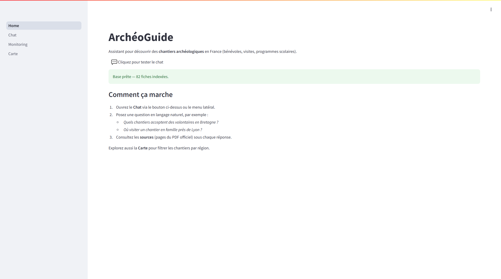
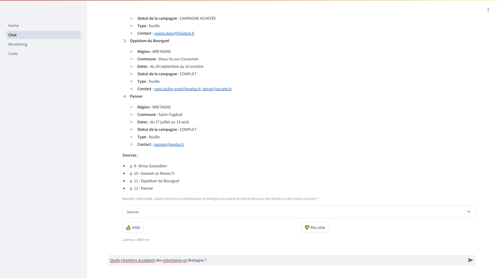
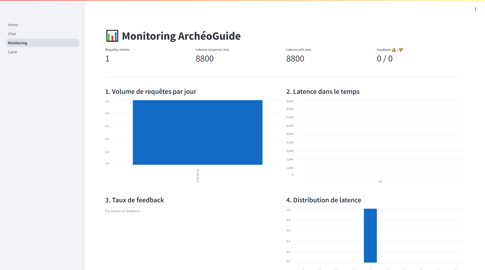
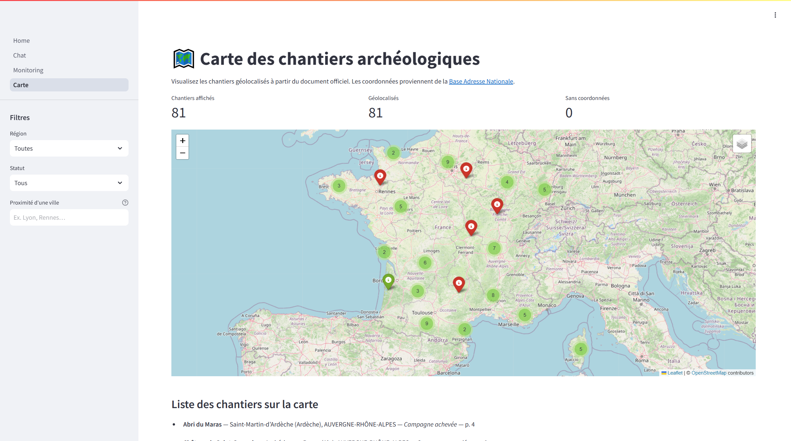

# ArchéoGuide — Intelligent Discovery Assistant for Youth Heritage Programs

Application RAG pour le **LLM Zoomcamp**. Elle aide les **jeunes**, **familles** et **enseignants** à trouver des chantiers archéologiques accessibles en France, à partir du document officiel du Ministère de la Culture.

🇬🇧 *Problem statement in French. Scoring, setup, and evaluation in English for reviewers.* If you only read three things: the [live demo](https://archoguide.onrender.com/Chat), **Problem Description**, and [docs/evaluation.md](docs/evaluation.md).

---

## Démo en ligne / Live demo

[](https://archoguide.onrender.com/Chat)

**[🇫🇷 Cliquez pour tester le chat](https://archoguide.onrender.com/Chat)** · **[🇬🇧 Click to try the chat](https://archoguide.onrender.com/Chat)**

> Au premier lancement (ou après inactivité sur le plan gratuit), l'indexation peut prendre quelques minutes. Rechargez la page si le chat indique que la base n'est pas encore prête.
>
> On first load (or after idle time on the free plan), indexing can take a few minutes. Reload if the chat says the knowledge base is not ready.

| Page | Contenu |
|---|---|
| Home | État de la base (~80 fiches) |
| Chat | Réponses RAG, sources PDF, 👍/👎 |
| Monitoring | Volume, latence, feedback |
| Carte | Carte + filtres région / statut / ville |



---

## Problem Description

### Contexte

Chaque année, le [Ministère de la Culture](https://www.culture.gouv.fr/thematiques/archeologie/ressources-documentaires/introduction-a-l-archeologie/la-liste-fouiller-en-benevole-ou-visiter-un-chantier-archeologique) publie un **PDF de ~13 Mo** recensant les chantiers archéologiques où l'on peut **fouiller en bénévole** ou **visiter un site** — y compris des programmes adaptés aux **enfants et aux scolaires**.

### Problème

| Difficulté | Impact |
|---|---|
| Document long et dense (~centaines de pages) | Difficile à parcourir pour un parent ou un enseignant pressé |
| Informations éparpillées par région, période, type de public | Une simple recherche Ctrl+F ne suffit pas pour des questions en langage naturel |
| Mise à jour régulière du PDF | Risque d'informations obsolètes si on garde une copie locale |
| Public cible (jeunes, familles) | Besoin de réponses claires, adaptées et fiables — pas de jargon administratif |

**Exemples de questions auxquelles le PDF doit répondre, mais difficilement sans outil :**
- *« Quels chantiers acceptent des volontaires de moins de 16 ans en Bretagne cet été ? »*
- *« Où peut-on visiter un chantier en famille près de Lyon en juillet ? »*
- *« Quels chantiers proposent une initiation à la préhistoire pour des collégiens ? »*

### Solution : ArchéoGuide

ArchéoGuide transforme ce PDF officiel en **assistant conversationnel** :

1. **Scraping automatisé** — téléchargement et détection de nouvelles versions du PDF
2. **Ingestion** — découpage, indexation dans une base vectorielle (Qdrant)
3. **Retrieval hybride** — recherche sémantique + mots-clés, avec re-ranking
4. **Génération LLM** — réponses en langage naturel, adaptées au public jeune, avec citations des sources

### Pourquoi un RAG (et pas un LLM seul) ?

- Le LLM **seul** inventerait des chantiers inexistants (hallucinations).
- Le RAG **ancre** chaque réponse dans le PDF officiel : les informations restent **vérifiables** et **à jour**.
- La recherche vectorielle permet de comprendre l'**intention** derrière une question floue, ce qu'une recherche textuelle classique ne fait pas bien.

Le corpus n'est **pas** la FAQ du Zoomcamp. C'est la liste officielle du Ministère.

---

## Zoomcamp criteria (self-assessment)

How to run: [docs/setup.md](docs/setup.md). Evidence: [docs/evaluation.md](docs/evaluation.md). Architecture (branches, tree, flow): [docs/architecture.md](docs/architecture.md). Usage examples: [docs/usage.md](docs/usage.md).

| Criterion | Score | Evidence |
| :--- | :---: | :--- |
| Problem description | 2/2 | **Problem Description** above |
| Retrieval flow | 2/2 | Hybrid RRF + catalog path — [architecture](docs/architecture.md) |
| Retrieval evaluation | 2/2 | Hit Rate / MRR on 20 queries — [evaluation](docs/evaluation.md#1-retrieval-evaluation) |
| LLM evaluation | 2/2 | 3 prompts + refusal test — [evaluation](docs/evaluation.md#4-llm--prompt-evaluation) |
| Interface | 2/2 | Streamlit Chat / Carte / Home — [usage](docs/usage.md) |
| Ingestion pipeline | 2/2 | Daily scrape + Prefect / Qdrant — [setup](docs/setup.md) |
| Monitoring | 2/2 | JSONL + dashboard — [usage](docs/usage.md#feedback-and-logs) |
| Containerization | 2/2 | `docker/docker-compose.yml` |
| Reproducibility | 2/2 | `.env.example`, pinned deps, this docs set |
| Best practices | 2/3 | Hybrid **measured**. Rewrite + rerank are implemented but **not retained for retrieval quality** (Hit Rate −5 pts, extra latency) — [evaluation](docs/evaluation.md#2-ablations-rewrite-and-rerank) |
| Bonus | 2/2 | [Render](https://archoguide.onrender.com/Chat) |

---

## Performance (summary)

Full tables, charts, protocol, and limitations: **[docs/evaluation.md](docs/evaluation.md)**  
Generated study (FR): [`eval/ETUDE_PERFORMANCE.md`](eval/ETUDE_PERFORMANCE.md)

| Retrieval mode | Hit Rate@5 | MRR |
|---|---:|---:|
| vector | 100% | 0.917 |
| bm25 | 100% | 0.821 |
| hybrid (default) | 100% | 0.902 |

Rewrite + rerank did **not** raise Hit Rate on this ground truth; they add ~1–3 s. End-to-end latency is ~6–9 s (generation dominates). Prompt `structured_citations` is the product default (lists + `Sources : p. X`); `factual_strict` scored higher on the empty-context refusal unit test.

```bash
python scripts/run_eval_retrieval.py -k 5 -v
python scripts/run_eval_llm.py -v
python scripts/run_performance_study.py
```





*Dashboard after one live query (~8.8 s). Volume is low on this screenshot; the six chart types are what matters.*



---

## Quick start

Full commands (ingest, Prefect, Docker, Render, env vars): **[docs/setup.md](docs/setup.md)**.

```bash
git clone https://github.com/dimiphoton/Arch-oGuide-Intelligent-Discovery-Assistant-for-Youth-Heritage-Programs.git
cd Arch-oGuide-Intelligent-Discovery-Assistant-for-Youth-Heritage-Programs
python -m venv archoguide-env
# Windows: archoguide-env\Scripts\activate
# Linux/macOS: source archoguide-env/bin/activate
pip install -r requirements-dev.txt
cp .env.example .env          # set OPENAI_API_KEY
pip install -r requirements-scraping.txt
python scripts/run_scraper.py
python scripts/check_setup.py
cd docker && docker compose up -d && cd ..
pip install -r requirements-ingest.txt
python scripts/run_ingest.py
pip install -r requirements-ui.txt
python scripts/run_app.py     # http://localhost:8501
```

```bash
python scripts/ask.py "Quels chantiers acceptent des volontaires en Bretagne ?"
python scripts/ask.py -k 8 "Visites de chantiers pour des collégiens"
python scripts/ask.py --no-rewrite --no-rerank "..."
```

Retrieval modes (`rag/config.py` / `.env`): `vector`, `bm25`, `hybrid` (default). Query rewriting and re-ranking can be turned off as above.

---

## Next ideas (not implemented)

Deux pistes produit, hors de cette soumission Zoomcamp :

1. **Scraper les programmes scolaires** — ingérer les offres pédagogiques dédiées (académies, DRAC jeunesse / scolaire), pas seulement le PDF bénévoles/visites, pour qu'un enseignant puisse demander une sortie de classe plutôt qu'une campagne de fouille.
2. **Pousser l'intelligence géographique** — la carte géocode déjà les sites (BAN) et filtre par région ou ~50 km autour d'une ville. Suite possible : temps de trajet, « près de mon collège », contours d'académies, itinéraires multi-sites.

---

## Language policy

| Surface | Language | Audience |
|---|---|---|
| Streamlit UI, answers, source PDF, problem statement | French | Families, teachers, youth programs, recruiters |
| Setup / architecture / evaluation docs, scoring table | English | Zoomcamp reviewers, engineering hiring |
| Generated study `eval/ETUDE_PERFORMANCE.md` | French | Local experiment log |

---

## Data Source

Document officiel : [La liste — fouiller en bénévole ou visiter un chantier archéologique](https://www.culture.gouv.fr/thematiques/archeologie/ressources-documentaires/introduction-a-l-archeologie/la-liste-fouiller-en-benevole-ou-visiter-un-chantier-archeologique) — Ministère de la Culture, Direction de l'archéologie.

---

## Tests

```bash
pytest tests/
```

---

*Developed for LLM Zoomcamp.*
