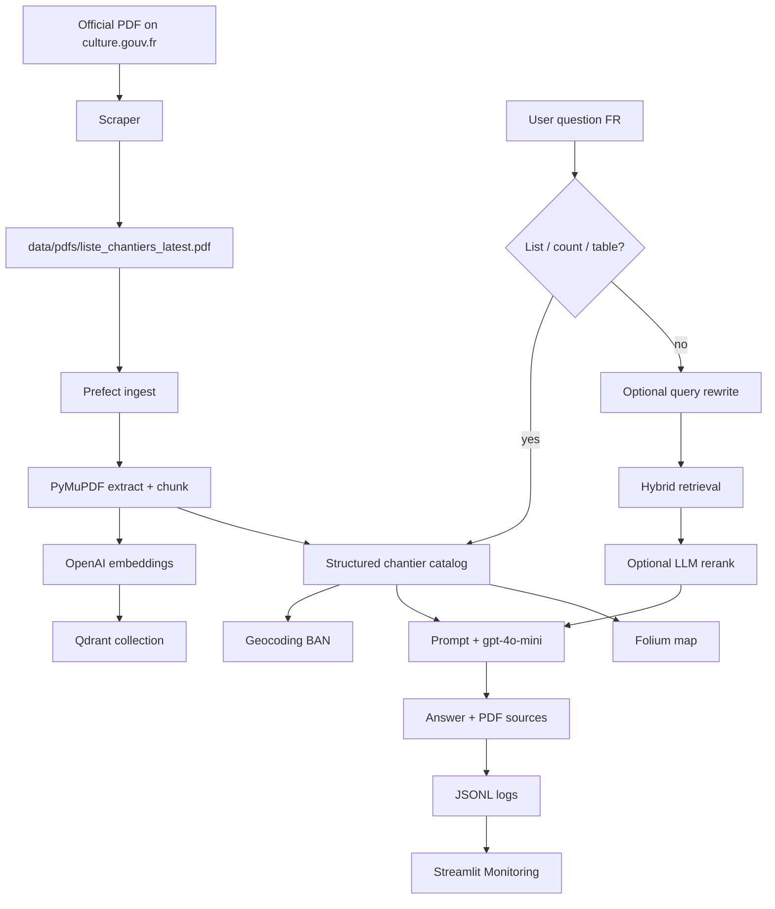

# Architecture

## Problem (for reviewers)

The French problem statement (table, example questions, why RAG) is in the [README](../README.md#problem-description). Short English version:

The Ministry of Culture publishes a ~13 MB PDF of volunteer / visit / school archaeological campaigns. It is long, split by region and audience, and updated regularly — Ctrl+F is not enough for questions like “volunteers under 16 in Brittany this summer?”.

| Pain | Impact |
|---|---|
| Hundreds of pages | Slow for a parent or teacher |
| Facts split by region, period, audience | Natural-language questions fail |
| PDF is republished | A local copy goes stale |
| Youth / family audience | Need plain language, not admin jargon |

A plain LLM would invent sites, dates, and emails. ArchéoGuide is a **RAG + catalog** app: answers are grounded in that official document, with page citations.

The knowledge base is **not** the DataTalks.Club Zoomcamp FAQ. The source is the Ministry list [*Fouiller en bénévole ou visiter un chantier archéologique*](https://www.culture.gouv.fr/thematiques/archeologie/ressources-documentaires/introduction-a-l-archeologie/la-liste-fouiller-en-benevole-ou-visiter-un-chantier-archeologique).

---

## End-to-end flow



Two answering paths share the same question:

1. **Catalog path** — for list / count / table questions (`rag/catalog.py`). Uses the full structured register (not `top_k`), so a “list every site in Brittany” question does not drop sites because of retrieval cutoff.
2. **RAG path** — rewrite → hybrid search (vector + BM25, RRF) → optional rerank → LLM generation with citations (`rag/pipeline.py`).

Metadata filters (region, town, “open campaigns only”) are parsed from the French question and applied on both paths.

---

## Data

| Item | Detail |
|---|---|
| Source | Ministry of Culture PDF (~13 MB, hundreds of pages) |
| Refresh | Daily GitHub Action + on-demand `scripts/run_scraper.py` |
| Chunking | One site record ≈ one chunk (`chunk_size=3000`) |
| Index | Qdrant collection `chantiers_archeo` |
| Snapshot | `data/index_snapshot.json.gz` for fast Render cold start |
| Geo | [Base Adresse Nationale](https://adresse.data.gouv.fr/) coordinates for the map |

---

## Stack

| Layer | Choice | Why |
|---|---|---|
| Ingestion | Prefect + PyMuPDF | Orchestrated PDF → chunks |
| Vectors | Qdrant | Local Docker or embedded on Render |
| Embeddings / LLM | OpenAI `text-embedding-3-small` / `gpt-4o-mini` | Course-compatible, cheap enough to eval |
| Retrieval | Hybrid RRF (vector + BM25) | Compared against vector-only and BM25-only |
| Interface | Streamlit (Home, Chat, Monitoring, Carte) | Reviewer-friendly, French product UI |
| Monitoring | JSONL logs + Streamlit charts | Feedback 👍/👎, latency, volume |
| Deploy | Docker Compose + Render Blueprint | Local repro + public URL |

No LangChain / LlamaIndex: the RAG steps are plain Python modules under `rag/`.

---

## Architecture & Roadmap (branches)

Course modules, all landed on the current tree:

| Branch | Contenu | Statut |
|---|---|---|
| `scrapping` | Téléchargement automatique du PDF (GitHub Actions quotidien) | ✅ |
| `docs/foundation` | Structure projet, config, README, deps pinées | ✅ |
| `ingest` | Pipeline Prefect : PDF → chunks → Qdrant | ✅ |
| `rag-core` | Retrieval vectoriel + LLM, CLI | ✅ |
| `eval-retrieval` | Comparaison BM25 / vector / hybrid | ✅ |
| `rag-advanced` | Query rewriting + re-ranking | ✅ |
| `eval-llm` | Comparaison de prompts | ✅ |
| `ui-streamlit` | Interface chat Streamlit | ✅ |
| `monitoring` | Feedback + dashboard | ✅ |
| `docker` | docker-compose complet | ✅ |
| `deploy-cloud` | Déploiement Render | ✅ |

---

## Repository layout

```
Arch-oGuide/
├── app/              # Interface Streamlit
├── monitoring/       # Logs et métriques
├── rag/              # Config, retrieval, génération
├── ingest/           # Pipeline d'ingestion PDF
├── eval/             # Évaluations retrieval & LLM
├── scrapping/        # Scraper PDF culture.gouv.fr
├── scripts/          # CLI (scraper, check_setup, ask…)
├── tests/            # Tests unitaires
├── docs/             # Setup, usage, architecture, evaluation
├── data/
│   ├── pdfs/         # PDF téléchargé (gitignored)
│   └── metadata.json # État du dernier scrape
├── docker/           # Dockerfile + docker-compose
├── requirements.txt
├── requirements-scraping.txt
├── requirements-ingest.txt
├── requirements-ui.txt
└── requirements-dev.txt
```

---

## Default production settings

From `rag/config.py`:

- Retrieval: `hybrid`
- `top_k`: 20
- Query rewrite: on (disable with `--no-rewrite` or `ENABLE_QUERY_REWRITE=false`)
- Rerank: on (disable with `--no-rerank` or `ENABLE_RERANK=false`)
- Prompt: `structured_citations`

Rewrite and rerank stay in the code. They were **not** retained as a retrieval-quality win (see [evaluation.md](evaluation.md#2-ablations-rewrite-and-rerank)). The prompt `structured_citations` is kept because the product needs listed sites + page sources, even though `factual_strict` scored better on the empty-context refusal test.
