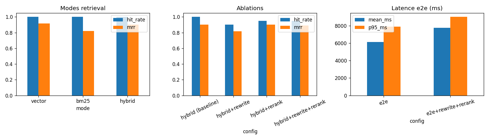
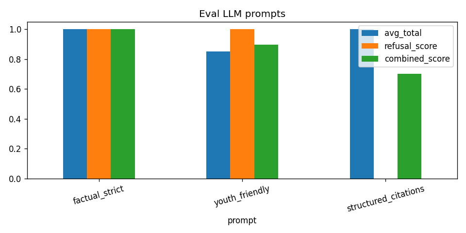

# Evaluation and performance evidence

This page is the reviewer-facing **proof** that ArchéoGuide was measured, not only built. Raw generated tables (French) live in [`eval/ETUDE_PERFORMANCE.md`](../eval/ETUDE_PERFORMANCE.md). Charts: [`eval/results/performance_charts.png`](../eval/results/performance_charts.png), [`eval/results/llm_eval_charts.png`](../eval/results/llm_eval_charts.png).

Reproduce:

```bash
python scripts/run_eval_retrieval.py -k 5 -v
python scripts/run_eval_llm.py -v
python scripts/run_performance_study.py
```

Needs Qdrant with the ingested collection and `OPENAI_API_KEY`. JSON dumps go to `eval/results/` (gitignored). The Markdown report is committed.

---

## Zoomcamp criteria map

The table below follows the usual LLM Zoomcamp project grid (same categories as the README self-assessment). If the official cohort form uses different wording, the **Where to look** column still points to the evidence.

| Criterion | What we built | Where to look |
|---|---|---|
| Problem description | Official Ministry PDF is unusable as a search UI for families and teachers | [README Problem Description](../README.md#problem-description), [architecture.md](architecture.md#problem-for-reviewers) |
| Knowledge base / ingestion | Scraper + Prefect flow: PDF → chunks → OpenAI embeddings → Qdrant; optional index snapshot | `ingest/`, `scrapping/`, [setup.md](setup.md) |
| Retrieval flow | Hybrid (vector + BM25, RRF), metadata filters, catalog path for list/count questions | `rag/retrieval.py`, `rag/pipeline.py`, `rag/catalog.py` |
| Retrieval evaluation | 20 questions, Hit Rate@5 and MRR for vector / BM25 / hybrid | § Retrieval below |
| LLM / RAG evaluation | 3 prompts × 8 questions + empty-context refusal | § LLM below |
| Interface | Streamlit: Chat, Carte, Home | [usage.md](usage.md), screenshots |
| Monitoring | JSONL logs, 👍/👎, 6 dashboard charts | [usage.md](usage.md#feedback-and-logs), screenshot |
| Containerization | `docker/docker-compose.yml` (Qdrant + app + ingest profile) | [setup.md](setup.md#docker-full-stack) |
| Reproducibility | Pinned requirements, `.env.example`, `check_setup.py`, this docs set | [setup.md](setup.md) |
| Best practices | Hybrid **measured**. Rewrite + rerank implemented, **not** a Hit Rate win (self-score **2/3**) | § Ablations below |
| Bonus | Public Render deploy + daily scrape Action | [https://archoguide.onrender.com/Chat](https://archoguide.onrender.com/Chat) |

Dataset check: the corpus is the Ministry of Culture volunteer/visit list, **not** the course FAQ.

---

## 1. Retrieval evaluation

**Protocol** (`eval/retrieval_eval.py`, `eval/performance_study.py`)

- Ground truth: `eval/ground_truth.json` — 20 French questions
- `top_k = 5`
- Embedding: `text-embedding-3-small`
- A chunk is a hit if it contains at least one `expected_keywords` token for that question

**Results** (run 2026-08-10, see `eval/ETUDE_PERFORMANCE.md`)

| Mode | Hit Rate@5 | MRR | Mean latency | P95 |
|---|---:|---:|---:|---:|
| `vector` | 100.0% | 0.917 | 322 ms | 923 ms |
| `bm25` | 100.0% | 0.821 | 55 ms | 74 ms |
| `hybrid` | 100.0% | 0.902 | 280 ms | 315 ms |

All three modes retrieve *a* relevant chunk at k=5. Ranking quality (MRR) is better for vector and hybrid than for BM25. Hybrid is the production default because named entities (towns, regions) still need lexical match when the embedding is vague.



### Limitation of the metric

Keywords such as `Bretagne` + `bénévole` are easy to hit in this PDF. Hit Rate@5 = 100% means “the right *region/theme* showed up”, not “the exact open campaign was ranked first”. That is why we also look at MRR, ablations, and qualitative answers (citations, campaign status, no invented emails).

---

## 2. Ablations: rewrite and rerank

Same 20 questions, hybrid retrieval, quality of chunks **before** generation.

| Config | Hit Rate@5 | MRR | Mean latency | P95 |
|---|---:|---:|---:|---:|
| `hybrid` (baseline) | 100.0% | 0.902 | 286 ms | 376 ms |
| `hybrid + rewrite` | 90.0% | 0.817 | 1609 ms | 2314 ms |
| `hybrid + rerank` | 95.0% | 0.900 | 1865 ms | 3276 ms |
| `hybrid + rewrite + rerank` | 95.0% | 0.892 | 3069 ms | 4312 ms |

Rewrite + rerank **did not** improve Hit Rate on this set; they add 1–3 s. They stay in the code (and are still on in production) because they change the *wording* of the query and the *order* of chunks shown to the LLM (UI caption *Requête reformulée*). They are **not** counted as a retrieval-quality win — that is why best practices is **2/3**, not 3/3. Reviewers can turn them off:

```bash
python scripts/ask.py --no-rewrite --no-rerank "..."
```

or set `ENABLE_QUERY_REWRITE=false` / `ENABLE_RERANK=false` in `.env`.

---

## 3. End-to-end latency (retrieve + generate)

Sample of 5 questions, pipeline `ask()`.

| Config | N | Mean | P50 | P95 |
|---|---:|---:|---:|---:|
| `e2e` | 5 | 6114 ms | 6134 ms | 7902 ms |
| `e2e + rewrite + rerank` | 5 | 7745 ms | 7087 ms | 9004 ms |

On the public Render demo, a Brittany volunteer question took **~8800 ms** (see [usage.md](usage.md#example-volunteers-in-brittany)). That matches the study: generation dominates retrieval.

---

## 4. LLM / prompt evaluation

**Protocol** (`eval/llm_eval.py`)

- 8 questions in `eval/llm_ground_truth.json`
- Metrics: keyword coverage in the answer (70%) + citation present when required (30%)
- Extra test: empty context (“chantiers en Antarctique”) must refuse honestly (patterns in `eval/llm_metrics.py`)
- Combined score = `0.7 * avg_total + 0.3 * refusal_score`

Three prompts (`rag/prompts.py`): `youth_friendly`, `factual_strict`, `structured_citations`.



| Prompt | What we observed | Production? |
|---|---|---|
| `factual_strict` | Best combined score on this harness (including refusal) | No — tone is too dry for families |
| `youth_friendly` | Good refusal, slightly weaker keyword coverage | No |
| `structured_citations` | Strong answers + `Sources : p. X` lists; **weaker empty-context refusal** on this test | **Yes** (default) |

We keep `structured_citations` because the product requirement is “list matching sites with page sources”. Honest refusal on *empty retrieval* is also handled **outside** the prompt: `rag/pipeline.py` returns a fixed French message when filters find no open campaign, and the catalog path does not call the LLM for large lists.

---

## 5. Qualitative check (live demo)

Question: *Quels chantiers acceptent des volontaires en Bretagne ?*

| Check | Result |
|---|---|
| Invents an open Brittany dig? | No — states that listed campaigns are `COMPLET` or `CAMPAGNE ACHEVÉE` |
| Lists real sites from the PDF? | Yes (Briou Goassélen, Goarem ar Manec’h, Oppidum du Bourguel, Panner, …) |
| Citations? | `p. 9`–`p. 12` plus expandable chunk previews |
| Contacts? | Official emails from the PDF, not invented |
| Rewrite visible? | Yes, caption under the answer |
| Feedback widget? | 👍 / 👎 |

Screenshot: [usage.md](usage.md#example-volunteers-in-brittany).

---

## 6. What we would tighten next

- Ground-truth keywords are coarse; a labelled `relevant_chunk_ids` set would make Hit Rate more discriminating.
- Re-run LLM eval after tightening the `structured_citations` refusal line (the harness currently favours `factual_strict`).
- Online eval: the Monitoring page already stores 👍/👎; we do not yet compute a rolling quality score from it.
